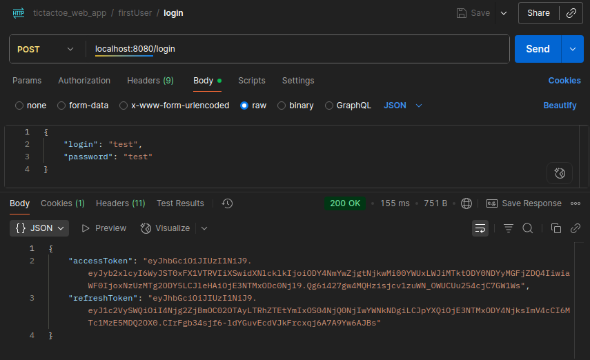
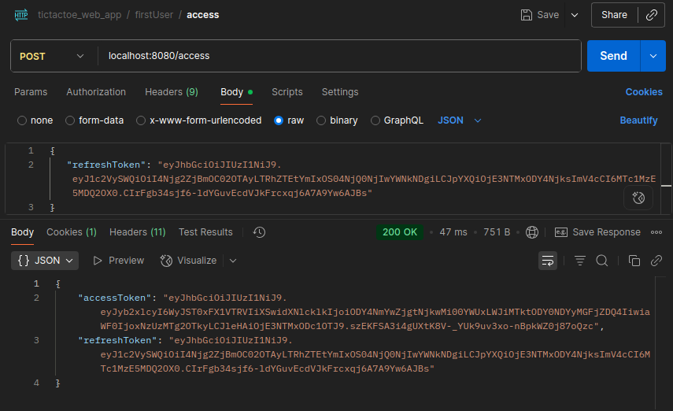
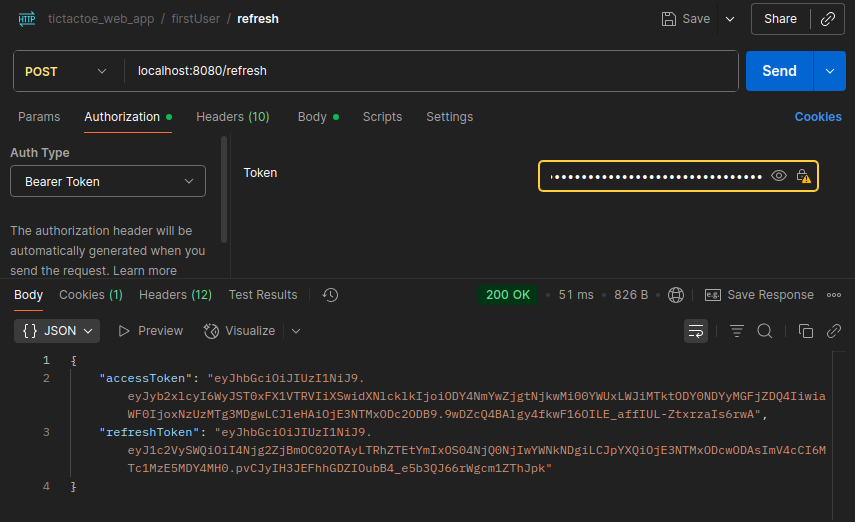
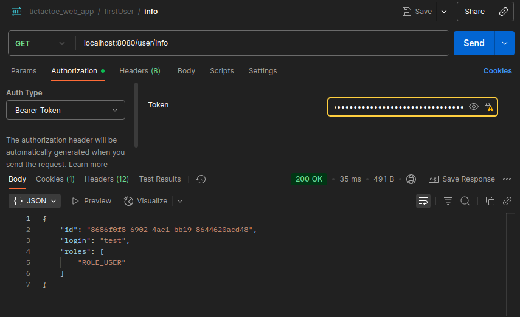
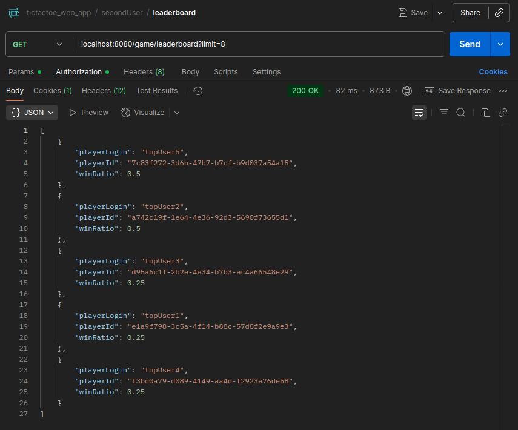

# tictactoe-web-application-v3_0

Обновление проекта [tictactoe-web-application-v2_0](https://github.com/dksss/tictactoe-web-application-v2_0).

В этой версии добавлена JWT-авторизация (сессионный токен, токен обновления). Переработан фильтр безопасности. Добавлена поддержка ролей пользователей и модель таблицы лидеров в игре.


## Общая информация

- Язык: Java
- Версия JDK: 21
- Система сборки: Gradle (Kotlin DSL)
- Фреймворки и библиотеки:
  - Spring Boot
  - Spring MVC
  - Spring Data
  - Spring Security
  - Hibernate


## Инструкция для запуска

1. Перейдите в корень проекта TicTacToe и выполните команду: ```sh run.sh```
  
    Эта команда поднимает Docker контейнеры с базой данных (PostgreSQL) и самим приложением через docker-compose. В файле *secret_data.env* находятся необходимые переменные окружения.
    >Доступ к БД осуществляется через порт 5454, приложение маппится с портом 8080

  **ИЛИ**

2. Соберите приложение, запустите выбранную базу данных и настройте параметры подключения в файле `src/main/resources/application.properties` согласно вашей конфигурации


## Добавленные или измененные эндпоинты

#### Эндпоинты, доступные пользователям без авторизации

* `POST /login` - измененный эндпоинт авторизации пользователя, теперь он принимает **JwtRequest** и возвращает **JwtResponse**

  

* `POST /access` - эндпоинт для обновления accessToken, который принимает **refreshToken** и возвращает **JwtResponse**.

  


#### Эндпоинты для авторизованных пользователей

* `POST /refresh` - эндпоинт для обновления refreshToken, который принимает **refreshToken** и возвращает **JwtResponse**.

  

* `GET /info` - эндпоинт для получения информации о пользователе по accessToken. Получает информацию о пользователе через контекст Spring Security.

  

* `GET /finished_games` - эндпоинт для получения всех завершенных игр.

* `GET /leaderboard`- эндпоинт для получения первых N лучших игроков, который принимает N (количество лучших игроков) и возвращает список лучших игроков (UUID и логин) с их соотношением побед. Информация о количестве передается через параметры запроса (`...?limit={limit}`).

  


## Описание изменений

- Добавлено перечисление ролей у пользователей, с единственной ролью *USER*. Для доменной модели роли сделано наследование от **GrantedAuthority**.
- Реализована поддержка ролей на всех основных слоях.
- Создан утилитарный слой **security** для работы с JWT.
  - Созданы модели JwtRequest, JwtResponse, RefreshJwtRequest
  - Создан утилитарный класс JwtProvider, который:
    - генерирует Access и Refresh токены с помощью соответствующих секретов (в форме base64) по модели User;
    - валидирует токены;
    - извлекает данные (полезную нагрузку) из токенов.
  - Создана модель JwtAuthentication, с наследованием от Authentication.
  - Добавлен класс JwtUtil, для создания JwtAuthentication по claims.
- Обновлен сервис авторизации, который использует UserService, JwtProvider, SecurityContextHolder
  - Измененный метод авторизации;
  - Добавлены методы обновления accessToken и refreshToken;
  - Добавлен метод получения JwtAuthentication.
- Обновлен контроллер авторизации [описание выше](#добавленные-или-измененные-эндпоинты).
- Изменено поведение метода doFilter класса AuthFilter (использует JwtProvider и JwtUtil)
- В модель игры добавлена дата ее создания
- Добавлен метод в репозиторий игры для получения всех завершенных игр по UUID пользователя (а также соответствующие методы в контроллере и сервисе).
- Добавлена модель для информации о выигранных играх, в которой есть UUID пользователя, логин и соотношение побед.
- Добавлен метод в контроллере игры для получения данных о пользователе и соотношении побед (а также соответствующие методы в контроллере и сервисе). Использует нативный синтаксис PostgreSQL, CTE, Join'ы и группировку по пользователям для получения информации из БД.